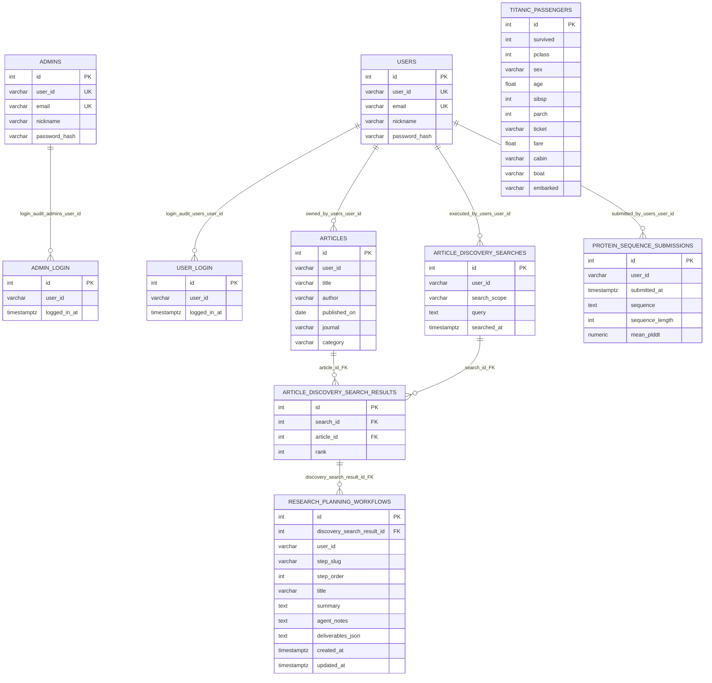
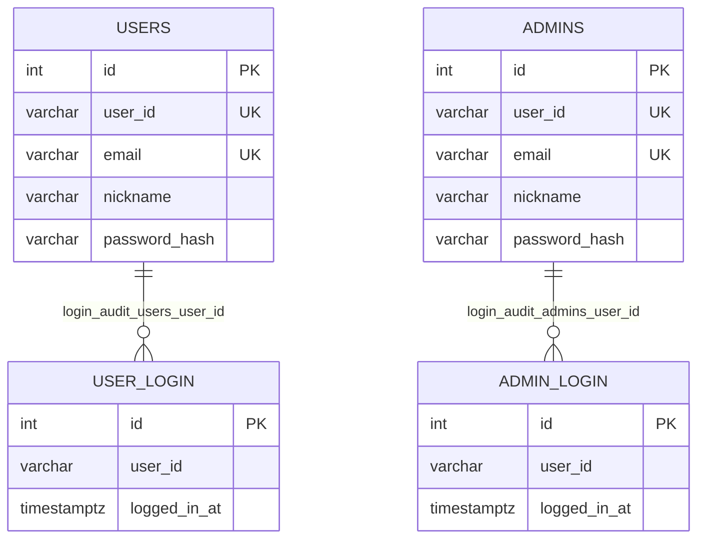
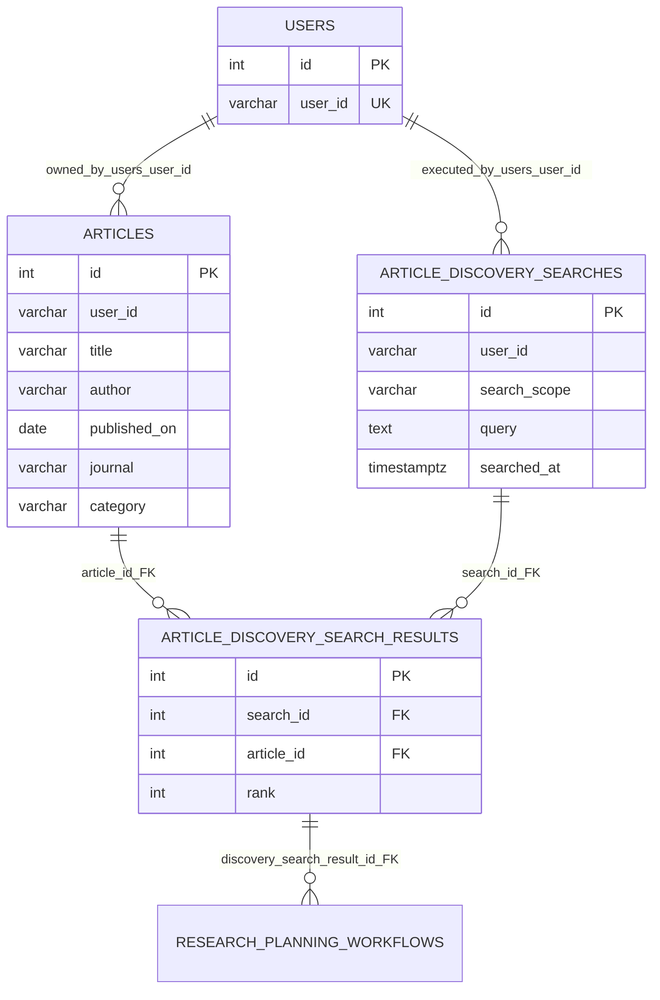
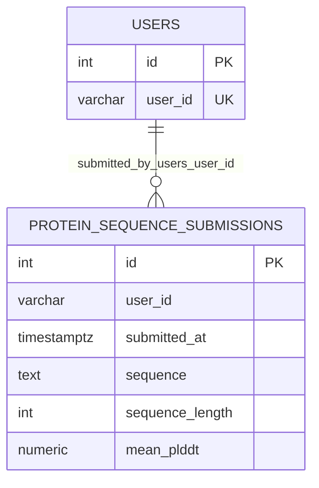
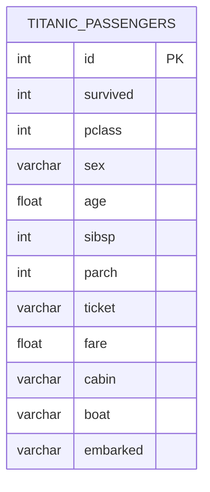

# backend/apps 전체 Entity ERD

`backend/apps`에 정의된 **모든 SQLAlchemy ORM 엔티티**(`database.Base` 상속)의 구조·관계 정리.

| 문서 | 범위 |
|------|------|
| 본 문서 | **전체 10개 엔티티** |
| [PROTEIER_ERD.md](./PROTEIER_ERD.md) | Proteier API·`init_db` 9테이블 상세 |
| [TITANIC_ERD.md](./TITANIC_ERD.md) | Titanic 도메인(개념·CSV) |
| [ENTITY_RULE.md](./ENTITY_RULE.md) | PK `id` 규칙 |

소스: [`database.py`](../../../backend/apps/database.py), 각 모듈 `*_entity.py`

Mermaid `erDiagram`은 속성·관계 라벨의 **따옴표·괄호·슬래시** 등에서 파싱 오류가 납니다. 필드 설명은 아래 표를 참고하세요.

---

## 엔티티 목록 (10)

| # | 모듈 | 클래스 | 테이블 | `register_orm_models` | `init_db` |
|---|------|--------|--------|----------------------|-----------|
| 1 | `secom` | `User` | `users` | ✅ | ✅ |
| 2 | `secom` | `Admin` | `admins` | ✅ | ✅ |
| 3 | `secom` | `UserLogin` | `user_login` | ✅ | ✅ |
| 4 | `secom` | `AdminLogin` | `admin_login` | ✅ | ✅ |
| 5 | `project_design` | `Article` | `articles` | ✅ | ✅ |
| 6 | `project_design` | `ArticleDiscoverySearch` | `article_discovery_searches` | ✅ | ✅ |
| 7 | `project_design` | `ArticleDiscoverySearchResult` | `article_discovery_search_results` | ✅ | ✅ |
| 8 | `project_design` | `ResearchPlanningWorkflow` | `research_planning_workflows` | ✅ | ✅ |
| 9 | `protein_design` | `ProteinSequenceSubmission` | `protein_sequence_submissions` | ✅ | ✅ |
| 10 | `titanic` | `Titanic` | `titanic_passengers` | ❌ | ❌ |

`matrix`, `doro`, `arcana`, `agora` 등은 **ORM 엔티티 없음** (서비스·CSV·pickle만 사용).

---

## ORM 상속 (코드)

```text
database.Base (DeclarativeBase, 테이블 아님)
├── secom.User, Admin, UserLogin, AdminLogin
├── project_design.Article, ArticleDiscoverySearch, ArticleDiscoverySearchResult
├── protein_design.ProteinSequenceSubmission
└── titanic.Titanic
```

| 항목 | 결과 |
|------|------|
| 공통 부모 | `database.Base`만 상속 |
| SQLAlchemy **테이블** 상속 | **없음** |
| 엔티티 간 IS-A | **없음** |
| `User` ↔ `Admin` | 동일 컬럼 구조, **별 테이블·무관계** |

---

## 참조 관계 요약

`user_id_logical` 같은 축약 라벨은 **ERD 가독용 임시 표기**였으며, 아래 표·[Mermaid 선 표기](#mermaid-선-표기)는 **관계 역할별 공식 용어**로 정리한다.

| 유형 | 관계 | 자식 컬럼 | DB FK | 앱에서의 의미 |
|------|------|-----------|-------|----------------|
| 비즈니스 ID · 로그인 이력 | USERS → USER_LOGIN | `user_login.user_id` | 없음 | `users.user_id` 문자열 복사. 로그인 시각만 적재 |
| 비즈니스 ID · 로그인 이력 | ADMINS → ADMIN_LOGIN | `admin_login.user_id` | 없음 | `admins.user_id` 문자열 복사 |
| 비즈니스 ID · 회원 소유 | USERS → ARTICLES | `articles.user_id` | 없음 | 논문 등록 회원. Discovery 검색 풀 필터에 사용 |
| 비즈니스 ID · 검색 실행자 | USERS → ARTICLE_DISCOVERY_SEARCHES | `article_discovery_searches.user_id` | 없음 | 검색을 실행한 회원 |
| 비즈니스 ID · 제출자 | USERS → PROTEIN_SEQUENCE_SUBMISSIONS | `protein_sequence_submissions.user_id` | 없음 | 서열을 제출한 회원 |
| 물리 | ARTICLE_DISCOVERY_SEARCHES → RESULTS | `search_id` CASCADE | `results` ↔ `search` |
| 물리 (식별) | ARTICLE_DISCOVERY_SEARCH_RESULTS → RESEARCH_PLANNING_WORKFLOWS | `discovery_search_result_id` CASCADE, UK `(discovery_search_result_id, step_slug)` | `workflows` ↔ `discovery_search_result` |
| 물리 | ARTICLES → RESULTS | `article_id` CASCADE | `discovery_search_results` ↔ `article` |
| M:N | ARTICLES ↔ SEARCHES | junction + UK | junction만 |
| 없음 | secom ↔ project_design ↔ protein_design | — | — |
| 없음 | titanic ↔ 그 외 전부 | — | — |

**API 인증:** Proteier 보호 API는 `X-User-Id` 헤더 → `users.user_id` 존재 여부 검증 (`require_user_id`). 위 비즈니스 ID 참조와 **동일 식별자**이나, DB에는 FK로 강제되지 않음.

**Discovery Search → Workflow:** 검색 → `article_discovery_search_results` (매칭·rank) → Agent가 `discovery_search_result_id` 기준으로 `research_planning_workflows` 저장. 상세: [PROTEIER_ERD.md § Discovery Search](./PROTEIER_ERD.md#discovery-search-현재-구현).

---

## 전체 ERD (Mermaid)



> `TITANIC_PASSENGERS`는 다른 테이블과 **연결선 없음** (`register_orm_models` 미포함, CSV/pickle 경로).

---

## 모듈별 다이어그램

### secom (회원·로그인)



### project_design (논문·Discovery)



> `USERS` 연결선은 **비즈니스 ID 참조(FK 없음)** 만 표시. Discovery 검색은 `executed_by` 회원이 `owned_by`로 등록한 `articles`만 대상.

### protein_design (단백질 서열)



### titanic (ORM만 존재, DB 등록 없음)



런타임: `WalterReader` → CSV, `RoseModel` → pickle. `/titanic/*` API.

---

## 카디널리티·제약

| 관계 | 카디널리티 | 제약 |
|------|------------|------|
| USERS → USER_LOGIN | 1 : N | — |
| ADMINS → ADMIN_LOGIN | 1 : N | — |
| USERS → ARTICLES | 1 : N | — |
| USERS → ARTICLE_DISCOVERY_SEARCHES | 1 : N | — |
| USERS → PROTEIN_SEQUENCE_SUBMISSIONS | 1 : N | — |
| SEARCHES → RESULTS | 1 : N | FK CASCADE |
| ARTICLES → RESULTS | 1 : N | FK CASCADE |
| ARTICLES ↔ SEARCHES | M : N | UK `(search_id, article_id)` |

---

## 엔티티 ↔ 파일

| 테이블 | 경로 |
|--------|------|
| `users` | `secom/app/models/user_entity.py` |
| `admins` | `secom/app/models/admin_entity.py` |
| `user_login` | `secom/app/models/user_login_entity.py` |
| `admin_login` | `secom/app/models/admin_login_entity.py` |
| `articles` | `project_design/app/models/article_entity.py` |
| `article_discovery_searches` | `project_design/app/models/article_discovery_search_entity.py` |
| `article_discovery_search_results` | `project_design/app/models/article_discovery_search_result_entity.py` |
| `research_planning_workflows` | `project_design/app/models/workflow_entity.py` |
| `protein_sequence_submissions` | `protein_design/app/models/protein_sequence_submission_entity.py` |
| `titanic_passengers` | `titanic/app/models/titanic_entity.py` |

---

## Mermaid 선 표기

| 라벨 | 의미 |
|------|------|
| `login_audit_users_user_id` | `user_login.user_id` = `users.user_id` (로그인 이력, **FK 없음**) |
| `login_audit_admins_user_id` | `admin_login.user_id` = `admins.user_id` (관리자 로그인 이력, **FK 없음**) |
| `owned_by_users_user_id` | `articles.user_id` = 등록 회원 `users.user_id` (**FK 없음**) |
| `executed_by_users_user_id` | `article_discovery_searches.user_id` = 검색 실행 회원 (**FK 없음**) |
| `submitted_by_users_user_id` | `protein_sequence_submissions.user_id` = 제출 회원 (**FK 없음**) |
| `discovery_search_result_id_FK` | `research_planning_workflows` → junction PK, CASCADE, UK `(result_id, step_slug)` |
| `search_id_FK` / `article_id_FK` | junction → searches / articles, CASCADE |
| `||--o{` | 1 : 0..N |

---

## 비-ORM 모듈 (ERD 밖)

| 모듈 | 데이터 | 비고 |
|------|--------|------|
| `matrix` | 외부 API | Gemini, 날씨 |
| `doro` | CSV | 도로공사 통계 |
| `arcana`, `agora` | — | 에이전트 스크립트 |
| `adapters` | — | DB 헬스 어댑터 |
| `titanic` (런타임) | CSV + pickle | ORM `Titanic`은 미등록 |
