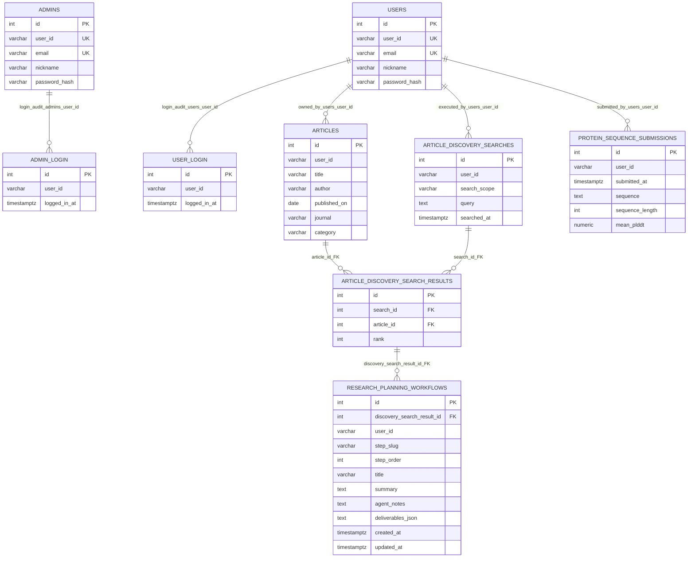
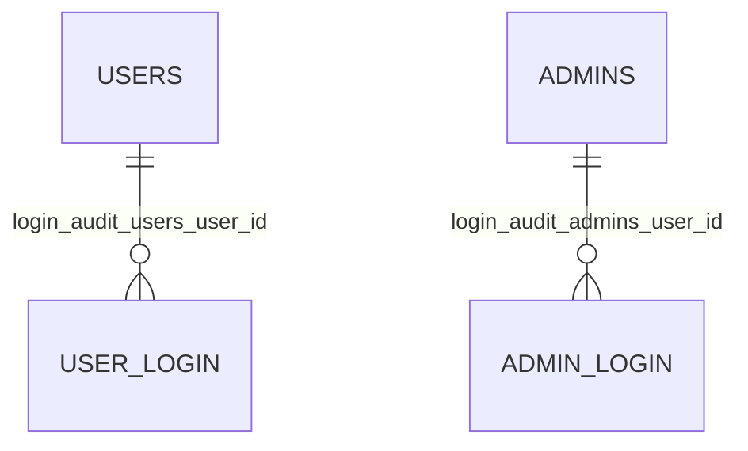
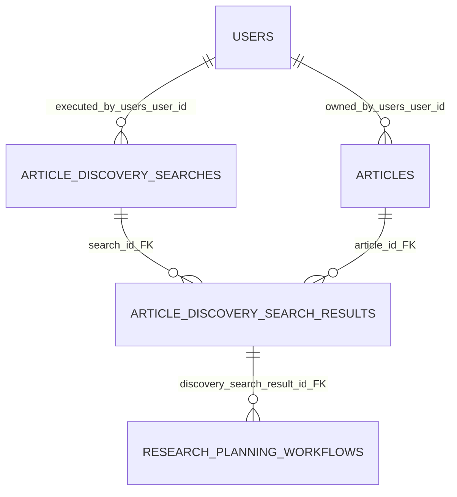
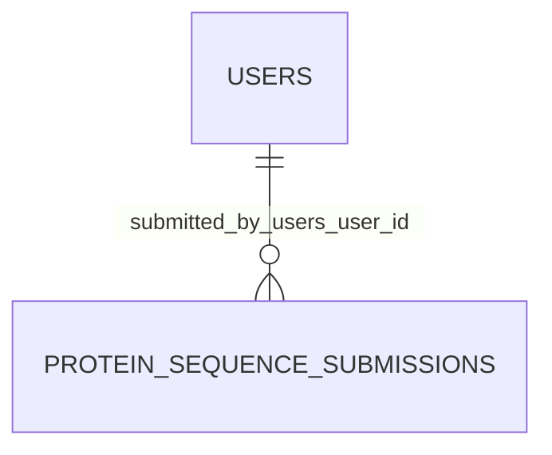
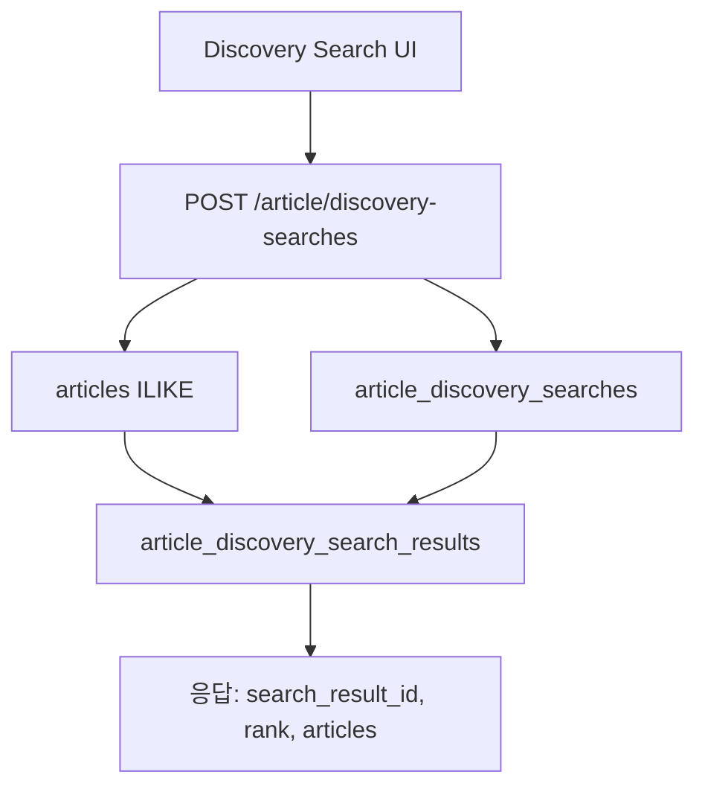
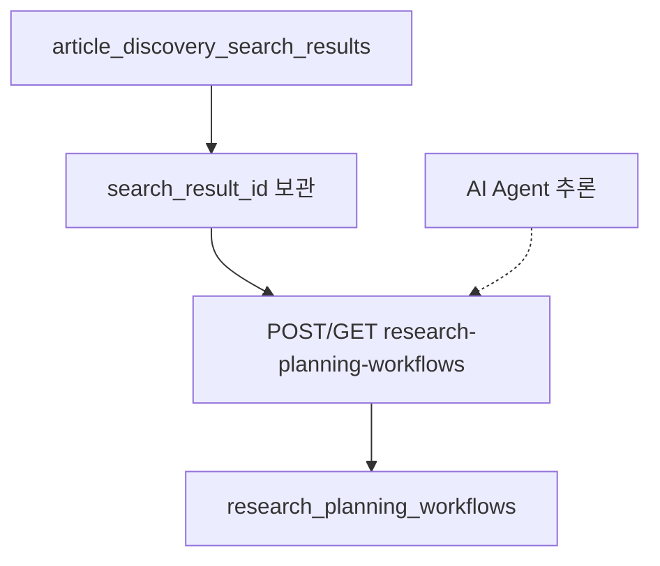
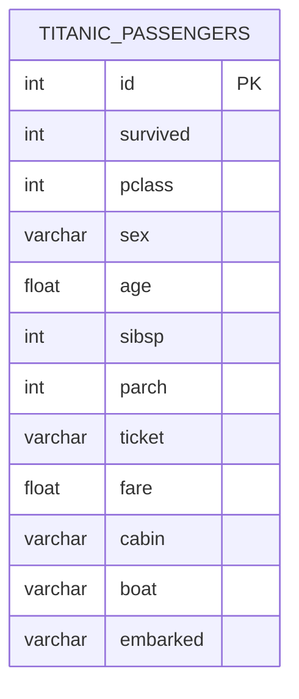

# Proteier ERD

`backend/apps` ORM 엔티티 중 **Proteier API·`init_db`가 사용하는 9개 테이블**의 구조·참조·런타임 흐름을 정리한다.

| 문서 | 범위 |
|------|------|
| **본 문서** | Proteier 9테이블 ERD·관계·API |
| [BACKEND_APPS_ERD.md](./BACKEND_APPS_ERD.md) | 전체 10엔티티 (`titanic` 포함) |
| [ENTITY_RULE.md](./ENTITY_RULE.md) | PK `id` 규칙 |
| [TITANIC_ERD.md](./TITANIC_ERD.md) | Titanic (미등록) |

**소스:** [`database.py`](../../../backend/apps/database.py) `register_orm_models()`, 각 `*_entity.py`

Mermaid `erDiagram`은 특수문자 파싱 이슈가 있을 수 있다. 필드·UK·FK 상세는 아래 표를 기준으로 한다.

---

## 1. 엔티티 목록 (`init_db` 9)

| # | 모듈 | 클래스 | 테이블 |
|---|------|--------|--------|
| 1 | `secom` | `User` | `users` |
| 2 | `secom` | `Admin` | `admins` |
| 3 | `secom` | `UserLogin` | `user_login` |
| 4 | `secom` | `AdminLogin` | `admin_login` |
| 5 | `project_design` | `Article` | `articles` |
| 6 | `project_design` | `ArticleDiscoverySearch` | `article_discovery_searches` |
| 7 | `project_design` | `ArticleDiscoverySearchResult` | `article_discovery_search_results` |
| 8 | `project_design` | `ResearchPlanningWorkflow` | `research_planning_workflows` |
| 9 | `protein_design` | `ProteinSequenceSubmission` | `protein_sequence_submissions` |

`matrix`, `doro`, `arcana`, `agora` — ORM 엔티티 없음.  
`titanic.Titanic` (`titanic_passengers`) — [부록](#부록-titanic-미등록).

---

## 2. ORM 상속 (코드)

```text
database.Base
├── secom: User, Admin, UserLogin, AdminLogin
├── project_design: Article, ArticleDiscoverySearch,
│                   ArticleDiscoverySearchResult, ResearchPlanningWorkflow
└── protein_design: ProteinSequenceSubmission
```

| 항목 | 결과 |
|------|------|
| 공통 부모 | `database.Base`만 상속 |
| SQLAlchemy 테이블 상속 | 없음 |
| 엔티티 간 IS-A | 없음 (`User`↔`Admin` 별 테이블) |
| `User` ↔ `Admin` | 컬럼 유사, **DB 관계 없음** |

---

## 3. 참조 관계 분석

### 3.1 물리 FK (DB + ORM `relationship`)

| 부모 | 자식 | FK 컬럼 | CASCADE | UK |
|------|------|---------|---------|-----|
| `article_discovery_searches` | `article_discovery_search_results` | `search_id` | ✅ | `(search_id, article_id)` |
| `articles` | `article_discovery_search_results` | `article_id` | ✅ | (위와 동일) |
| `article_discovery_search_results` | `research_planning_workflows` | `discovery_search_result_id` | ✅ | `(discovery_search_result_id, step_slug)` |

- `articles` ↔ `article_discovery_searches` **직접 FK 없음** → junction으로 **M:N**.
- `research_planning_workflows`는 **매칭 1건(junction PK)** 에 종속(식별 관계). Agent 입력 단위 = 특정 `search_result_id`.

### 3.2 비즈니스 ID 참조 (FK 없음)

자식 테이블의 `user_id`(varchar)가 `users.user_id` 또는 `admins.user_id`와 **문자열로만** 대응한다. PostgreSQL FK·ORM `relationship` 없음.

| Mermaid 라벨 | 관계 | 자식 컬럼 | 앱 의미 |
|--------------|------|-----------|---------|
| `login_audit_users_user_id` | USERS → USER_LOGIN | `user_login.user_id` | 회원 로그인 이력 |
| `login_audit_admins_user_id` | ADMINS → ADMIN_LOGIN | `admin_login.user_id` | 관리자 로그인 이력 |
| `owned_by_users_user_id` | USERS → ARTICLES | `articles.user_id` | 논문 등록·소유 회원 |
| `executed_by_users_user_id` | USERS → ARTICLE_DISCOVERY_SEARCHES | `article_discovery_searches.user_id` | Discovery 검색 실행 회원 |
| `submitted_by_users_user_id` | USERS → PROTEIN_SEQUENCE_SUBMISSIONS | `protein_sequence_submissions.user_id` | 서열 제출 회원 |

`research_planning_workflows.user_id`도 동일 패턴(비즈니스 ID 복사, FK 없음). 소유 검증은 `discovery_search_result_id` → junction → search의 `user_id`로 수행.

### 3.3 모듈 경계

`secom` · `project_design` · `protein_design` 사이 **DB FK 없음**.  
Proteier 보호 API: `X-User-Id` → `users.user_id` 검증 (`secom.app.auth.require_user_id`).

---

## 4. 전체 ERD (Proteier 9테이블)



---

## 5. 모듈별 ERD

### secom



### project_design (Research Planning 핵심)



```text
users.user_id
  → articles (등록)
  → article_discovery_searches (검색 실행)
       → article_discovery_search_results (매칭 + rank)
            → research_planning_workflows (단계별 Agent 요약)
```

### protein_design



---

## 6. 카디널리티·관계 표

| 관계                                   | 카디널리티 | DB FK                        | ORM                                | 설명                                 |
| ------------------------------------ | ----- | ---------------------------- | ---------------------------------- | ---------------------------------- |
| USERS → USER_LOGIN                   | 1 : N | 없음                           | —                                  | `login_audit_users_user_id`        |
| ADMINS → ADMIN_LOGIN                 | 1 : N | 없음                           | —                                  | `login_audit_admins_user_id`       |
| USERS → ARTICLES                     | 1 : N | 없음                           | —                                  | `owned_by_users_user_id`           |
| USERS → ARTICLE_DISCOVERY_SEARCHES   | 1 : N | 없음                           | —                                  | `executed_by_users_user_id`        |
| USERS → PROTEIN_SEQUENCE_SUBMISSIONS | 1 : N | 없음                           | —                                  | `submitted_by_users_user_id`       |
| ARTICLE_DISCOVERY_SEARCHES → RESULTS | 1 : N | `search_id`                  | `search.results`                   | CASCADE, `order_by=rank`           |
| ARTICLES → RESULTS                   | 1 : N | `article_id`                 | `article.discovery_search_results` | CASCADE                            |
| ARTICLES ↔ DISCOVERY_SEARCHES        | M : N | junction                     | —                                  | UK `(search_id, article_id)`       |
| RESULTS → WORKFLOWS                  | 1 : N | `discovery_search_result_id` | `result.workflows`                 | 식별 FK, UK `(result_id, step_slug)` |

---

## 7. 런타임 흐름

### Discovery Search

**UI:** 3칸 + 행별 AND/OR + Search  
**검색 풀:** `articles.user_id ==` 로그인 회원



| 단계 | 동작 |
|------|------|
| 1 | `article_discovery_searches` INSERT |
| 2 | 본인 `articles` SELECT (chained AND/OR ILIKE, 최대 50건) |
| 3 | 매칭마다 `article_discovery_search_results` INSERT (`rank`) |
| 4 | 응답에 `search_result_id`, `rank`, 논문 메타데이터 |

**`query` 감사 예:** `research_target+and=protein; design_methodology=CRISPR`  
**`search_scope`:** `combined_chain`

### Research Planning Workflow



| 단계 | 동작 |
|------|------|
| 5 | 프론트: 1순위 `search_result_id` (`sessionStorage`) |
| 6 | `POST /article/research-planning-workflows` — `discovery_search_result_id` + `step_slug` upsert |
| 7 | `GET ?discovery_search_result_id=` — 저장된 단계 요약 (또는 `?discovery_search_id=` 전체 조회) |

**`step_slug` 예:** `source-and-query-setup`, `crawl-and-ingest`, `target-shortlist`, `research-plan-draft`

---

## 8. 엔티티 ↔ 소스 파일

| 테이블 | 경로 |
|--------|------|
| `users` | `secom/app/models/user_entity.py` |
| `admins` | `secom/app/models/admin_entity.py` |
| `user_login` | `secom/app/models/user_login_entity.py` |
| `admin_login` | `secom/app/models/admin_login_entity.py` |
| `articles` | `project_design/app/models/article_entity.py` |
| `article_discovery_searches` | `project_design/app/models/article_discovery_search_entity.py` |
| `article_discovery_search_results` | `project_design/app/models/article_discovery_search_result_entity.py` |
| `research_planning_workflows` | `project_design/app/models/workflow_entity.py` |
| `protein_sequence_submissions` | `protein_design/app/models/protein_sequence_submission_entity.py` |

---

## 9. 필드 설명

### secom · protein_design

| 엔티티 | 필드 | 설명 |
|--------|------|------|
| USERS | id | 시스템 PK |
| USERS | user_id | 비즈니스 ID (UK) |
| USERS | email | UK |
| USERS | nickname | 표시 이름 |
| USERS | password_hash | bcrypt |
| ADMINS | id / user_id / email / nickname / password_hash | 관리자 계정 (구조 동일, 테이블 분리) |
| USER_LOGIN | user_id | `users.user_id` 복사 (FK 없음) |
| USER_LOGIN | logged_in_at | UTC |
| ADMIN_LOGIN | user_id | `admins.user_id` 복사 (FK 없음) |
| ADMIN_LOGIN | logged_in_at | UTC |
| PROTEIN_SEQUENCE_SUBMISSIONS | user_id | 제출 회원 (FK 없음) |
| PROTEIN_SEQUENCE_SUBMISSIONS | submitted_at | UTC |
| PROTEIN_SEQUENCE_SUBMISSIONS | sequence | 아미노산 서열 |
| PROTEIN_SEQUENCE_SUBMISSIONS | sequence_length | 길이 |
| PROTEIN_SEQUENCE_SUBMISSIONS | mean_plddt | ESMFold 평균, nullable |

### project_design

| 엔티티 | 필드 | 설명 |
|--------|------|------|
| ARTICLES | user_id | 등록 회원 `users.user_id` (FK 없음) |
| ARTICLES | title / author / published_on / journal / category | 논문 메타 |
| ARTICLE_DISCOVERY_SEARCHES | user_id | 검색 실행 회원 (FK 없음) |
| ARTICLE_DISCOVERY_SEARCHES | search_scope | `combined_chain` |
| ARTICLE_DISCOVERY_SEARCHES | query | 감사용 결합 문자열 |
| ARTICLE_DISCOVERY_SEARCHES | searched_at | UTC |
| ARTICLE_DISCOVERY_SEARCH_RESULTS | id | junction PK → workflow 부모 |
| ARTICLE_DISCOVERY_SEARCH_RESULTS | search_id | FK → searches |
| ARTICLE_DISCOVERY_SEARCH_RESULTS | article_id | FK → articles |
| ARTICLE_DISCOVERY_SEARCH_RESULTS | rank | 1..N |
| RESEARCH_PLANNING_WORKFLOWS | discovery_search_result_id | FK → junction (식별) |
| RESEARCH_PLANNING_WORKFLOWS | user_id | 회원 ID 복사 (FK 없음, 감사·필터) |
| RESEARCH_PLANNING_WORKFLOWS | step_slug | 단계 식별자 |
| RESEARCH_PLANNING_WORKFLOWS | step_order | 1..4 |
| RESEARCH_PLANNING_WORKFLOWS | title / summary / agent_notes | Agent 요약 본문 |
| RESEARCH_PLANNING_WORKFLOWS | deliverables_json | Deliverables JSON 배열 |
| RESEARCH_PLANNING_WORKFLOWS | created_at / updated_at | UTC |

---

## 10. Mermaid 선 표기

| 라벨 | 의미 |
|------|------|
| `login_audit_users_user_id` | 로그인 이력, `users.user_id`, FK 없음 |
| `login_audit_admins_user_id` | 관리자 로그인 이력, FK 없음 |
| `owned_by_users_user_id` | 논문 소유 회원, FK 없음 |
| `executed_by_users_user_id` | Discovery 검색 실행 회원, FK 없음 |
| `submitted_by_users_user_id` | 서열 제출 회원, FK 없음 |
| `search_id_FK` / `article_id_FK` | junction 물리 FK, CASCADE |
| `discovery_search_result_id_FK` | workflow → junction, CASCADE, 식별 |
| `||--o{` | 1 : 0..N |

> 과거 `user_id_logical`은 **임시 축약**이었으며 본 문서에서는 사용하지 않는다.

---

## 11. 관련 API

| 영역 | 메서드 | 경로 | 주요 테이블 |
|------|--------|------|-------------|
| 회원가입 | POST | `/signup` | `users` |
| 로그인 | POST | `/login` | `users`, `user_login` |
| 관리자 | POST | `/admin/signup`, `/admin/login` | `admins`, `admin_login` |
| 논문 등록 | POST | `/article/articles` | `articles` |
| Discovery 검색 | POST | `/article/discovery-searches` | searches, results, articles |
| Workflow 저장 | POST | `/article/research-planning-workflows` | `research_planning_workflows` |
| Workflow 조회 | GET | `/article/research-planning-workflows` | `?discovery_search_result_id=` 또는 `?discovery_search_id=` |
| 단백질 서열 | POST | `/protein-design/sequence-submissions` | `protein_sequence_submissions` |

보호 API: 헤더 `X-User-Id` 필수 (workflow·discovery·articles·protein).

---

## 부록: Titanic (미등록)

`Titanic` (`titanic_passengers`) — `register_orm_models()` **미포함**. Proteier ERD·`init_db` **대상 아님**. CSV/pickle·`/titanic/*`.



전체 10엔티티 목록: [BACKEND_APPS_ERD.md](./BACKEND_APPS_ERD.md).
